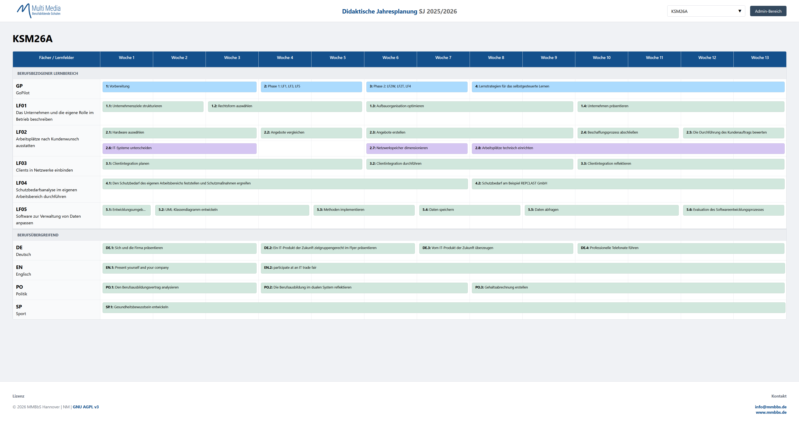
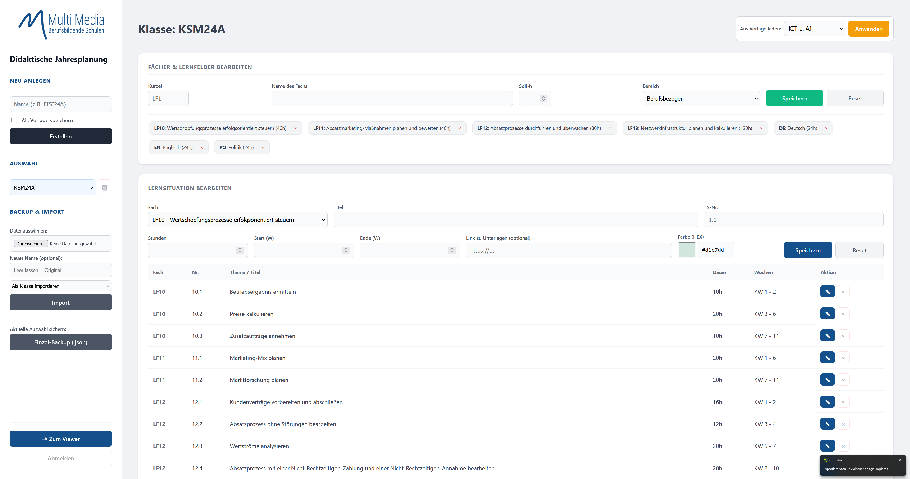

# MMBbS Didaktische Jahresplanung

Ein spezialisiertes Web-Tool zur Erstellung, Verwaltung und Visualisierung didaktischer Jahresplanungen an den Multi Media Berufsbildenden Schulen Hannover.

## 📸 Einblicke

### Public Viewer

Die Benutzeroberfläche für Schüler und Lehrkräfte zur Ansicht der aktuellen Planungen.

### Admin-Panel

Das Backend zur Verwaltung von Lernsituationen, Stundenkontingenten und Zeiträumen.

-----

## 🚀 Features

  - **Duale Ansicht:** 
      - **Viewer (`index.php`):** Übersichtliche, farbkodierte Blockplanung mit Filterfunktion für Klassen.
      - **Admin (`admin.php`):** Vollständige Kontrolle über alle Daten inklusive Import/Export-Logik.
  - **Flexibles "Stacking":** Überlappende Lernsituationen werden automatisch in Zeilen untereinander gestapelt.
  - **Daten-Portabilität:** Schneller Wechsel zwischen Klassen und Vorlagen durch JSON-basierte Datenhaltung.

## 📂 Beispiel-Daten (JSON)

Im Projekt sind bereits Vorlagen und Beispieldaten für die kaufmännischen IT-Berufe enthalten:

  * erstes und zweites Ausbildungsjahr der kaufmännischen IT-Berufe
  * drittes Ausbildungsjahr der Kaufleute für Digitalisierungsmanagement
  * drittes Ausbildungsjahr der Kaufleute für IT-System-Management
  * **Beispiel-Klassen:** Drei vorkonfigurierte Klassen zur sofortigen Demonstration der Funktionalität.

## 🛠️ Installation

1.  **Server-Check:** PHP 7.4+ Webserver (z. B. Apache/Nginx).
2.  **Upload:** Alle Dateien (`index.php`, `admin.php`, `didakt_data.json`, `logo.png`) hochladen.
3.  **Screenshots:** Die Dateien `index.png` und `admin.png` für die Anzeige in dieser Readme im Root-Verzeichnis ablegen.
4.  **Rechte:** Schreibrechte für `didakt_data.json` vergeben (`chmod 664`).
5.  **Login:** Standard-Passwort in `admin.php` anpassen (Variable `$password`).

## 📊 Technische Details

  - **Backend:** PHP (Single-File Logic).
  - **Frontend:** CSS Grid für die zeitliche Darstellung der Blöcke (Woche 1–13 pro Block).
  - **Speicher:** `didakt_data.json` – einfach zu sichern und versionierbar über Git.

## 📄 Lizenz

Dieses Tool ist unter der **GNU Affero General Public License v3.0 (AGPL-3.0)** lizenziert. Der Quellcode muss bei Bereitstellung über ein Netzwerk zugänglich gemacht werden.

-----

*Entwickelt für die MMBbS Hannover*